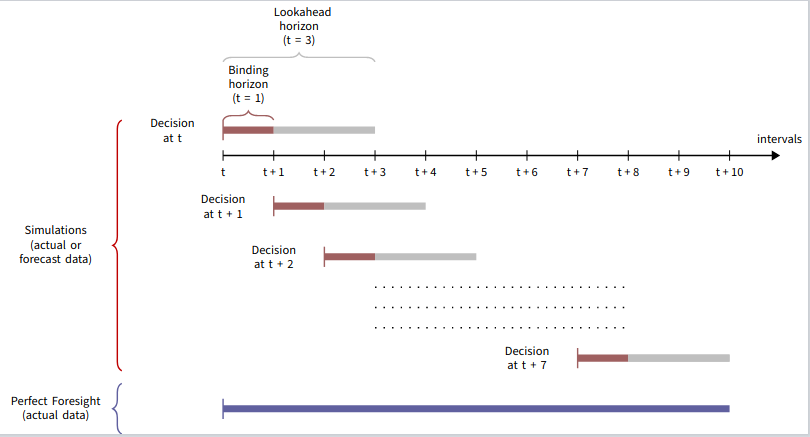

# Terminology

## Price Data

All price data is in AUD/MW/hr.

### Forecast

*Forecast* data refers to price data compiled from 30-minute pre-dispatch (`PD`, or `PREDISPATCH`) and 5-minute pre-dispatch (`P5MIN` or `5MPD`) forecasts.

30-minute pre-dispatch forecasts run half an hour and one hour prior to real-time (*actual* run time) are removed as they overlap with the `P5MIN` horizon.

### Actual

*Actual* price data refers to cleared prices for a region as published by AEMO.

## Simulation Components and Periods

### Model

The storage device operator has information available at decision time ``t_0`` (i.e. end of an interval), and, based on an optimisation problem from end of the next interval (``t_1``) to ``t_{1 + t_h}`` where ``t_h`` is the lookahead horizon, makes *decisions* for future intervals.

  * One (i.e. ``t_1``) or more of the decisions at the start of the model period can be *binding*. These decisions are fixed and cannot be updated by the next model period (i.e. the next model period is run with the last *binding* decision interval of the previous model period as the decision time)
  * Remaining decisions in the lookahead horizon are *non binding*. Decisions for these intervals can be updated by successive model periods in the simulation

Models are characterised by:

  * `StorageModelFormulation`, which describe which variables, constraints and/or objective function is incorporated into the optimisation model
  * `DegradationModel`, which describes how degradation is modelled and simulated

### Simulation

A *simulation* is a rolling horizon optimal control problem in which:

  1. At the decision time, initial storage state and price data are inputs into a model of the first lookahead horizon
  2. The model is solved, and certain decisions are considered binding
  3. The next decision time is the last binding interval. The storage state is updated, the lookahead horizon is rolled along, and another model is constructed and solved
  4. This is repeated until the entire simulation period has been simulated
  
  In the example below, a simulation consists of models with a lookahead horizon of 3 and a binding horizon of 1:
  
  
